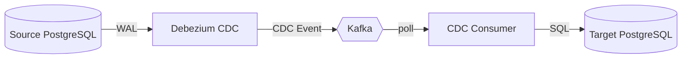

# MkDocs Flow Player

Turn Mermaid diagrams into step-by-step executable documentation.

MkDocs Flow Player combines a Mermaid topology with a small YAML scenario DSL.
The MkDocs plugin validates references during the build and embeds a vanilla-JS
player with Reset, Previous, Next and Play/Pause controls.


<sub>Illustrative SVG mock-up of the player. The real player renders the topology with Mermaid and is driven by the controls; see the [worked example](#worked-example).</sub>

## Quick start

```bash
python -m venv .venv
. .venv/bin/activate
pip install -e '.[test]'
mkdocs serve -f example/mkdocs.yml
```

Open <http://127.0.0.1:8000>.

Enable the plugin in `mkdocs.yml`:

```yaml
plugins:
  - search
  - flow-player:
      validation: strict
```

Add a flow to a Markdown page:

```text
::: interactive-flow
diagram: flows/cdc.mmd
scenario: flows/cdc-normal.yaml
:::
```

Paths are resolved from `docs_dir`. Mermaid node IDs are the public API used by
the scenario. A broken node or edge reference fails `mkdocs build` in strict mode.
Each scenario `id` must be unique across the whole site; a repeat is reported like
any other validation error (build failure in `strict`, placeholder in `warning`).

### Config options

| Option | Default | Purpose |
| --- | --- | --- |
| `validation` | `strict` | `strict` fails the build on any flow error; `warning` logs it and renders a placeholder. |
| `mermaid_url` | pinned jsDelivr CDN (Mermaid 11.17.2) | URL or docs-relative path of the Mermaid script. Set to `""` to inject nothing. |

**Offline / vendored Mermaid** — download `mermaid.min.js` into `docs/` and point
the option at it:

```yaml
plugins:
  - flow-player:
      mermaid_url: assets/mermaid.min.js   # docs/assets/mermaid.min.js
```

Or set `mermaid_url: ""` and load Mermaid yourself through `extra_javascript` /
theme overrides. The plugin's own `flow-player.js` and `.css` are always injected.

## Worked example

These two files live under [`example/docs/flows/`](example/docs/flows/) and produce
the flow shown above.

**Topology** — `cdc.mmd`:



**Scenario** — `cdc-normal.yaml`. Every `node` and every `from`/`to` must resolve to
an ID in the topology:

```yaml
id: normal-replication
title: Normal replication
settings:
  step_duration: 1500
steps:
  - node: DB
    state: active
    title: Transaction committed
    description: PostgreSQL commits the source transaction.
  - edge:
      from: DB
      to: CDC
    action: travel
    title: WAL change
  - node: CDC
    state: active
    title: CDC event created
    payload:
      table: rules
      operation: UPDATE
      lsn: "0/16B3740"
  - edge:
      from: CDC
      to: KAFKA
    action: travel
    title: Event published
  - node: KAFKA
    state: success
    title: Event stored
    payload:
      topic: rules
      partition: 2
      offset: 18342
  - edge:
      from: KAFKA
      to: CONSUMER
    action: travel
    title: Event polled
  - node: CONSUMER
    state: active
    title: Processing event
  - edge:
      from: CONSUMER
      to: TARGET
    action: travel
    title: SQL applied
  - node: TARGET
    state: success
    title: Transaction committed
```

**Page** — reference both from any Markdown page under `docs_dir`:

```text
::: interactive-flow
diagram: flows/cdc.mmd
scenario: flows/cdc-normal.yaml
:::
```

**Rendered HTML** — during `mkdocs build` the plugin validates every reference and
replaces the directive with a self-contained player. Source and scenario are
embedded as HTML-safe JSON (abridged here):

```html
<div class="flow-player" data-flow-id="normal-replication">
  <header class="flow-player__header"><strong>Normal replication</strong></header>
  <script type="application/json" class="flow-player__mermaid">"flowchart LR\n    DB[(Source PostgreSQL)]\n    …"</script>
  <script type="application/json" class="flow-player__scenario">{"id":"normal-replication","title":"Normal replication","settings":{"step_duration":1500},"steps":[{"node":"DB","state":"active","title":"Transaction committed", …}]}</script>
  <div class="flow-player__canvas" aria-label="Normal replication"></div>
  <nav class="flow-player__controls" aria-label="Flow controls">
    <button type="button" data-action="reset">Reset</button>
    <button type="button" data-action="previous">Previous</button>
    <button type="button" data-action="next">Next</button>
    <button type="button" data-action="play">Play</button>
  </nav>
  <section class="flow-player__details" aria-live="polite">
    <div class="flow-player__counter">Ready</div>
    <h4 class="flow-player__step-title">Select Next to start</h4>
    <p class="flow-player__description"></p>
    <pre class="flow-player__payload" hidden></pre>
  </section>
</div>
```

**In the browser** — `flow-player.js` renders the Mermaid source into
`.flow-player__canvas`, then walks the scenario as the reader steps through it:

- `node` steps set one `flow-state-*` class (`active`, `success`, `warning`, `error`,
  `waiting`) on the matching `g.node`; the last applicable step per node wins.
- `edge` + `action: travel` steps send a `<circle class="flow-traveller">` along the
  edge path, in a `flow-player__marker-layer` overlay so it stays above the edge labels.
- Play advances one step every `step_duration` ms; Previous and Reset rebuild node
  state without replaying travel animations.

## Scenario DSL (v0.1)

```yaml
id: normal-replication
title: Normal replication
settings:
  step_duration: 1500
steps:
  - node: DB
    state: active
    title: Transaction committed
  - edge:
      from: DB
      to: CDC
    action: travel
    title: WAL change
```

Supported states: `active`, `success`, `warning`, `error`, `waiting`.

`state` defaults to `active` on node steps. Edge steps accept only `action: travel`
(also the default). Each step contains exactly one of `node` or `edge`.
`title` and `description` must be strings; `step_duration` is an integer from
1 to 600000 milliseconds (default 1500). Unknown fields and invalid types are
reported as flow validation errors, including in `warning` mode.

Payload accepts JSON-compatible values, including `false`, `0` and `null`.
YAML dates/timestamps become ISO strings; NaN/Infinity, binary values, sets,
non-string object keys, cyclic aliases and nesting beyond 64 levels are rejected.

### Editor autocomplete

A JSON Schema for the scenario file ships with the package at
[`src/mkdocs_flow_player/schema/scenario.schema.json`](src/mkdocs_flow_player/schema/scenario.schema.json).
Point the [YAML language server](https://github.com/redhat-developer/yaml-language-server)
(built into the VS Code *YAML* extension) at it with a modeline at the top of a
scenario file:

```yaml
# yaml-language-server: $schema=https://raw.githubusercontent.com/AlexSol/mkdocs-flow-player/main/src/mkdocs_flow_player/schema/scenario.schema.json
id: normal-replication
...
```

or map it in `settings.json` for all `flows/*.yaml`:

```json
"yaml.schemas": {
  "https://raw.githubusercontent.com/AlexSol/mkdocs-flow-player/main/src/mkdocs_flow_player/schema/scenario.schema.json": "docs/**/flows/*.yaml"
}
```

The schema validates structure only. Node and edge references are checked against
the topology during `mkdocs build`. `from mkdocs_flow_player.schema import
scenario_schema` returns the parsed schema for other tooling.

### Supported Mermaid syntax

The build-time validator deliberately supports a **flowchart subset**, not every
Mermaid diagram type. Use `flowchart` or `graph` with `LR`, `RL`, `TB`, `TD` or `BT`
on its own line (or followed by a semicolon). Node IDs use ASCII letters, digits,
underscores and internal hyphens, beginning with a letter or underscore.

Supported forms include separate node declarations, implicit nodes, inline node
shapes and chains, for example:

```text
flowchart LR
    A[Source] -->|event| B[(Queue)] --> C[Consumer]
    C -.-> A
```

Supported links: `-->`, `-.->`, `==>`, `---`, `--o`, `--x`, with optional `|label|`.
Common bracket-based shapes (`[]`, `()`, `(())`, `[()]`, `{}`, `{{}}`, `[[]]`)
and double-quoted labels are supported. Keep complex label text double-quoted;
use Mermaid entities for embedded quotes. Newlines/semicolons separate statements;
`%%` comments are accepted. Do not put unquoted semicolons in edge labels.

Subgraphs, grouped links (`A & B`), class/style/click statements, custom edge IDs,
frontmatter, and new `@{...}` shape syntax are not supported in this version.
Parallel edges between the same ordered pair are rejected because `from`/`to`
cannot identify one unambiguously. Unsupported syntax fails with a readable error.

The Markdown directive is top-level; examples inside backtick/tilde fences or
indented code blocks remain literal. Source and scenario data are embedded as
HTML-safe JSON, warning messages are escaped, and Mermaid uses strict security.
This does not sandbox the rest of a MkDocs site: publish only reviewed documentation.

### Playback

- Each node has exactly one current state; the last applicable step wins.
- Previous/Reset rebuild the state without replaying travel animations.
- Pause freezes both the marker and the step clock; Play resumes the same step.
- Manual Next/Previous stops autoplay. Play after completed autoplay restarts.
- A failed player does not prevent other players on the page from initializing.

Keyboard: the player is a labelled `role="group"` and the diagram is a focusable
`role="img"`. With focus anywhere inside it, <kbd>&rarr;</kbd>/<kbd>&darr;</kbd>
step forward, <kbd>&larr;</kbd>/<kbd>&uarr;</kbd> step back, <kbd>Home</kbd> resets
and <kbd>End</kbd> jumps to the last step. A control that disables itself at an end
of the range hands focus to Play. The details panel is an `aria-live` region, so
each step is announced.

### Theme and layout

Colours are driven by CSS custom properties on `.flow-player`. On Material for
MkDocs they inherit its palette and follow its light/dark toggle
(`[data-md-color-scheme]`); on other themes they fall back to CSS system colours,
which track the OS. In dark mode the state colours brighten and Mermaid's
light-theme SVG is re-tinted so the diagram matches the page. Below ~30rem the
padding tightens and the controls become full-width tap targets; a wide diagram
scrolls inside the canvas rather than the page. `prefers-reduced-motion` hides the
travelling marker. Override any `--flow-*` token in your own stylesheet to
restyle.

### Tests

```bash
pytest -q
node --test tests/js/*.test.cjs
mkdocs build -f example/mkdocs.yml --strict
```

GitHub Actions runs these checks on push and pull requests, builds the Python
package, and runs the browser smoke test with a local Mermaid asset.

The JavaScript unit tests use Node's built-in runner and a deterministic clock
(no npm installation needed). For browser smoke tests against real Mermaid:

```bash
npm install
npx playwright install chromium
npm run test:browser
```

The browser test expects the built example and downloads Mermaid through the same
CDN URL as the example. For an offline run, set `MERMAID_TEST_SCRIPT` to a local
copy of that upstream script. `CHROMIUM_EXECUTABLE` optionally selects an installed
Chromium binary. The npm dependencies are development-only, not plugin runtime
dependencies. The CDN is pinned to Mermaid 11.17.2; override `mermaid_url` in the
plugin config to use another compatible build or a [vendored copy](#config-options).

## Design constraints

- Mermaid owns graph layout and SVG rendering.
- Python handles integration, loading, validation and HTML generation.
- JavaScript handles playback and animation.
- YAML is converted to JSON at build time.
- No React, React Flow, JointJS, D3, backend or browser-side YAML parser.

See [TODO.md](TODO.md) for current status and the roadmap, and
[docs/proposals/](docs/proposals/) for roadmap items still under design.
